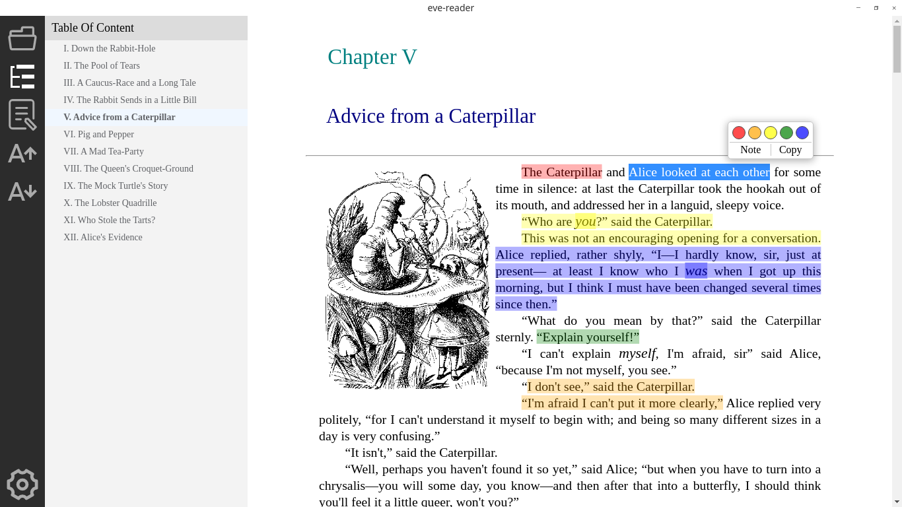

## Updata 更新
This project is no longer maintained. If you are interested in my new reader project, please visit https://github.com/EvoReader/EvoReader.

此项目已不再维护。如果您对我的新阅读器项目感兴趣，请移步至 https://github.com/EvoReader/EvoReader 。


<h2 align="center" style="">Eve Reader</h2>

<div align="center">
  <strong>Epub Reader, focused on annotation.</strong></br>
  <sub>Available for Web, Linux, Windows & macOS(coming soon).</sub>
</div>

<div align="center">
  <h3>
    <a href="https://xianmin.github.io/EveReader">
      Demo
    </a>
    <span> | </span>
    <a href="https://github.com/xianmin/EveReader/releases">
      Downloads
    </a>
    <span> | </span>
    <a href="https://github.com/xianmin/EveReader#Development">
      Development
    </a>
  </h3>
</div>

## Screenshot



## First of all

**This project is still under development. Currently, I don't have a development environment for mac, So there is no macOS version yet**

Recently, I will focus on the development of the mobile version.

**Welcome all kinds of suggestions and contributions!**

## Basic technology

- [epub.js](https://github.com/futurepress/epub.js/)
- [Vue.js](https://vuejs.org/)
- [element UI](https://github.com/ElemeFE/element)
- [Vue CLI Plugin Electron Builder](https://nklayman.github.io/vue-cli-plugin-electron-builder/)

## TODO Eve Reader 1.0.0

- [x] fontsize change
- [x] Save reading progress
- [ ] Search
- [ ] Theme change, user custom style
- [ ] Custom setting
- [ ] More Shortcuts
- [ ] A better LOGO

## Development

```bash
# install dependencies
yarn install

# Compiles and hot-reloads for web development
yarn run serve

# Compiles and minifies for production
yarn run build

# for electron development
yarn run electron:serve

# electron build for linux and windows
yarn run electron:build --linux deb --win nsis
```

## License

This project is licensed under the AGPL-3.0 License.
